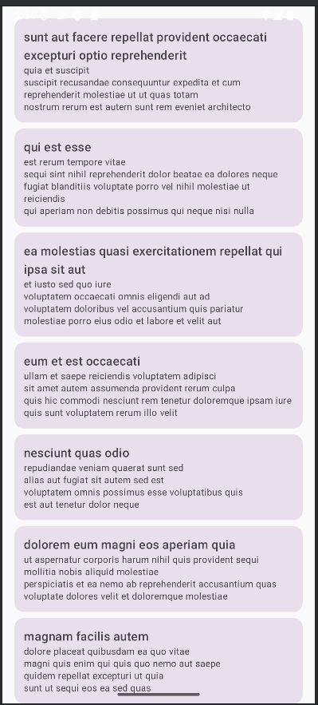

# Лабораторная работа 17-18 DI (Hilt) 
## Тема: 
Введение в dependency injection на Android. Настройка Hilt, базовые аннотации и внедрение
зависимостей. Продвинутое использование Hilt: области видимости, квалификаторы, несколько реализаций и
тестирование.
## Выполненные шаги
### Часть 1. Базовая настройка Hilt (ЛР17)
1 Добавлены зависимости в build.gradle.kts (проект и модуль):

- Плагин com.google.dagger.hilt.android

- Библиотеки hilt-android, hilt-compiler (через kapt), hilt-navigation-compose

2 Создан класс приложения с аннотацией @HiltAndroidApp:

3 Главная Activity помечена @AndroidEntryPoint, ручное создание зависимостей удалено.

4 Созданы Hilt-модули для каждого слоя

- NetworkModule – предоставляет Gson и Retrofit (@Singleton)

- ApiModule – предоставляет интерфейс PostApi

- RepositoryModule – связывает интерфейс PostRepository с реализацией PostRepositoryImpl (через @Binds)

- UseCaseModule – предоставляет GetPostsUseCase и AddPostUseCase

5 ViewModel переведена на Hilt
6 Экран Compose получает ViewModel через hiltViewModel()
### Часть 2. Расширенные возможности Hilt (ЛР18)
1 Области видимости:

- Все основные компоненты (репозиторий, API, UseCase) имеют @Singleton – живут всё время приложения.

2 Квалификаторы (@Qualifier):

- Созданы собственные аннотации: @IoDispatcher, @DefaultDispatcher, @MorningGreeting, @EveningGreeting.

- Написан DispatcherModule, предоставляющий CoroutineDispatcher с пометкой @IoDispatcher.

- В PostRepositoryImpl теперь внедряется диспетчер:

- Созданы две реализации интерфейса GreetingService (утренняя и вечерняя). В GreetingModule через @Binds и квалификаторы связаны интерфейс с реализациями.
 

- В PostsViewModel внедрены обе версии сервиса и в init выведены логи.

3  Инъекция в ViewModel нескольких зависимостей

## Работа приложения

## Выводы

Внедрение Hilt полностью автоматизировало создание зависимостей, убрав ручной код из MainActivity. Использование областей видимости гарантирует правильное время жизни компонентов (например, синглтоны для тяжёлых объектов). Квалификаторы позволили гибко подставлять разные реализации одного интерфейса (пример с GreetingService и диспетчерами). Такой подход повышает тестируемость – можно легко заменить реальную реализацию на мок-объект в юнит-тестах. Архитектура приложения сохраняет принципы Clean Architecture, а Hilt идеально интегрируется в неё, не нарушая направление зависимостей.
